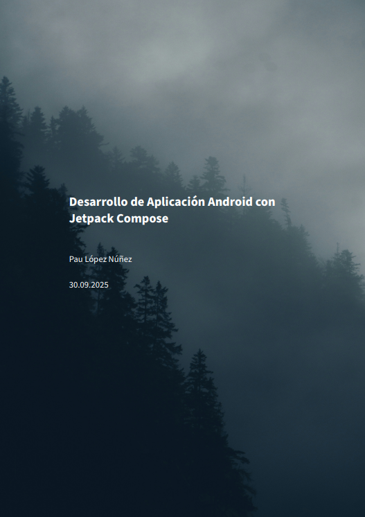
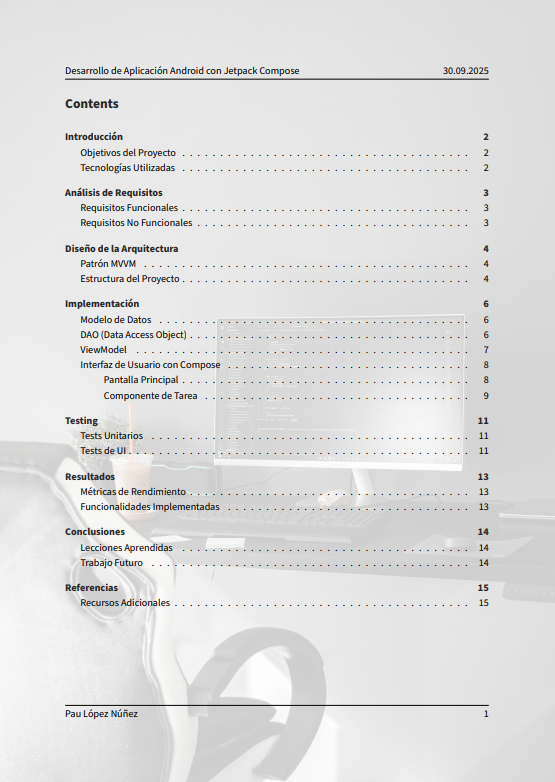

# Markdown to PDF Professional

> Sistema completo y automatizado para convertir documentos Markdown a PDFs de calidad profesional con un solo comando.

[](https://pandoc.org/)
[](https://miktex.org/)
[](https://github.com/PowerShell/PowerShell)
[](LICENSE)

## Características

- Conversión en 1 comando - De Markdown a PDF en segundos
- Dos estilos profesionales - Simple (minimalista) y Eisvogel (premium)
- Instalación automática - Descarga e instala Eisvogel automáticamente
- Soporte de imágenes - Portadas personalizadas y marcas de agua
- Plantillas listas - Generador automático de documentos
- Configuración reutilizable - Un setup, infinitos documentos
- UTF-8 completo - Soporte para acentos, ñ y caracteres especiales

## Ejemplos

<h3 style="text-align:center;">Estilo Eisvogel</h3>

<div style="text-align:center;">
  
  
</div>


## Inicio Rápido

### Requisitos Previos

1. **Windows** 7 o superior
2. **[Pandoc](https://pandoc.org/installing.html)** - Conversor de documentos
3. **[MiKTeX](https://miktex.org/download)** - Motor LaTeX (~300MB)

### Instalación

```powershell
# 1. Clonar repositorio
git clone https://github.com/TU_USUARIO/markdown-to-pdf-pro.git
cd markdown-to-pdf-pro

# 2. Copiar scripts a tu carpeta de trabajo
# O añadir al PATH de Windows para acceso global
```

### Uso Básico

```powershell
# Crear nuevo documento
.\new-doc.ps1 mi-practica -Style eisvogel

# Editar el archivo .md generado

# Convertir a PDF
.\convert.ps1 mi-practica.md -Template eisvogel

# Listo - Tu PDF profesional está generado
```
## Nota sobre ejecución de scripts en PowerShell

En PowerShell hay dos formas de ejecutar scripts:

- `.\script.ps1` → Obliga a usar un archivo que esté exactamente en la carpeta actual.  
- `script.ps1` (sin `.\`) → PowerShell lo busca en el **PATH** o en la ubicación actual según su configuración.

👉 Si no añadiste la carpeta `scripts/` al **PATH**, deberás usar `.\` y estar en la carpeta donde están los `.ps1`.  
👉 Si añadiste `scripts/` al **PATH**, puedes llamar `new-doc.ps1` y `convert.ps1` directamente desde cualquier carpeta.

## Estructura del Proyecto

```
markdown-to-pdf-pro/
├── scripts/
│   ├── convert.ps1           # Script de conversión MD → PDF
│   ├── new-doc.ps1            # Generador de plantillas
│   └── pandoc-config.yaml     # Configuración estilo simple
├── ejemplos/
│   ├── documento-simple.md
│   ├── documento-eisvogel.md
│   ├── portada.jpg            # Ejemplo de portada
│   └── watermark.png          # Ejemplo de marca de agua
├── docs/
│   └── TUTORIAL.md            # Tutorial completo
└── README.md
```

## Casos de Uso

- **Trabajos académicos** - Prácticas, proyectos, TFG/TFM
- **Documentación técnica** - APIs, manuales, guías
- **Reportes profesionales** - Informes, análisis, presentaciones
- **Apuntes de clase** - Notas organizadas y formateadas

## Personalización

### Portadas Personalizadas

```yaml
---
title: "Mi Documento"
titlepage-background: ./mi-portada.jpg
titlepage-text-color: "FFFFFF"
---
```

### Marcas de Agua

```yaml
page-background: ./mi-logo.png
```

### Estilos de Código

Soporta resaltado de sintaxis para 200+ lenguajes:

````markdown
```python
def hola_mundo():
    print("Hola!")
```
````

## Documentación

- [Tutorial Completo](docs/TUTORIAL.md)
- [Solución de Problemas](docs/TUTORIAL.md#solución-de-problemas)
- [Tips y Trucos](docs/TUTORIAL.md#tips-y-trucos)

## Contribuir

Las contribuciones son bienvenidas:

1. Fork el proyecto
2. Crea tu rama (`git checkout -b feature/mejora`)
3. Commit cambios (`git commit -m 'Añadir mejora'`)
4. Push a la rama (`git push origin feature/mejora`)
5. Abre un Pull Request

## Comandos Rápidos

| Acción | Comando |
|--------|---------|
| Crear documento simple | `.\new-doc.ps1 nombre` |
| Crear documento Eisvogel | `.\new-doc.ps1 nombre -Style eisvogel` |
| Convertir simple | `.\convert.ps1 nombre.md` |
| Convertir Eisvogel | `.\convert.ps1 nombre.md -Template eisvogel` |

## Problemas Conocidos

- Primera conversión lenta (MiKTeX descarga paquetes)
- Portadas requieren imágenes oscuras para texto blanco visible
- PATH debe configurarse manualmente en Windows

## Licencia

MIT License - Consulta [LICENSE](LICENSE) para más detalles

## Agradecimientos

- [Pandoc](https://pandoc.org/) - Motor de conversión
- [Eisvogel](https://github.com/Wandmalfarbe/pandoc-latex-template) - Plantilla LaTeX
- [MiKTeX](https://miktex.org/) - Distribución LaTeX

## Enlaces Útiles

- [Sintaxis Markdown](https://www.markdownguide.org/)
- [Documentación Pandoc](https://pandoc.org/MANUAL.html)
- [Eisvogel Template](https://github.com/Wandmalfarbe/pandoc-latex-template)

---

¿Te resultó útil? Dale una estrella al repositorio